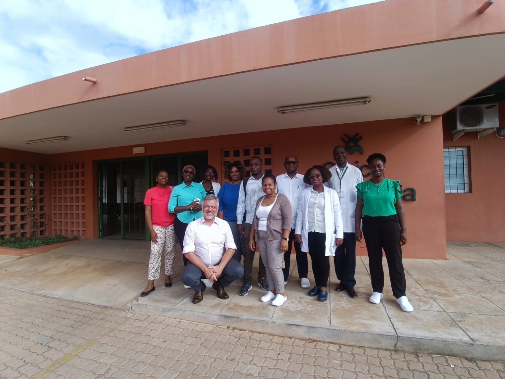

# Presentation {.unnumbered}

### MATAPA Project - Model of Care with Teamwork, Access, Participation and Coordination for the Design, implementation and evaluation of a new Primary Health Care model for Mozambique. 

This project is already under development in its early stages by the National Institute of Health
in partnership with Mozambican and international leaders in Family and Community Medicine.

project participants:

1. Amiggini Assiete Armando De Azevedo Sacuro
2. Helia Fernanda Covane Maholela Mananze
3. ⁠Rosa Igrete Armando Pareque
4. Sónia da Graça Carlos Muiocha
5. Telma Alegria Soda Licumba
6. Yolanda Carina Fernandes Marcelino Sabino
7. Nina Lino Jamisse Machava
8. Gil Ernesto Muvale
9. Palmira Francisco 
10. Josefina Afonso Mate Mazalo
11. Manuel Mussalafo Nhaguilunguane
12. Rosa Julieta Salomone Ngungulo da Silva
13. Célia Regina Tito Tovele     
14. Armando José Bucuane
15. Ermínia Rosa José Massango Binane
16. Hortêncio Faria
17. Cremildo Dauene
18. Ofélia Rambique
19. Adelson Guaraci Jantsch

