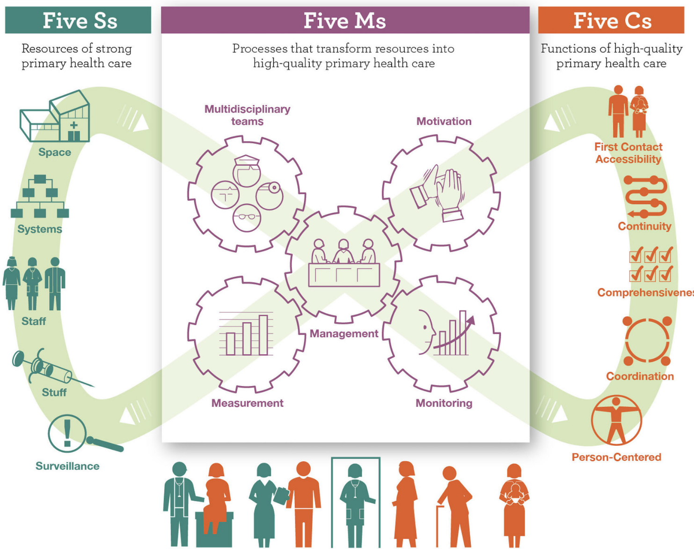

# Models of Care {.unnumbered}

## Concept and Framework

"Model of care" refers to the conceptualization and operationalization of how services are delivered: clinical processes, provider organization, service management, and population management, with clearly defined roles and responsibilities along care pathways. This definition is adopted by WHO/EMRO and is consistent with your initial synthesis distinguishing service selection/organization, delivery platforms, service management, and population management. [PHC-oriented models of care](https://www.emro.who.int/uhc-health-systems/access-health-services/phc-oriented-models-of-care.html){target="_blank"}

## PHC-Oriented Models of Care

For PHC-oriented systems, the model is anchored in the Integrated People-Centred Health Services agenda and the PHC Operational Framework (WHO/UNICEF), which detail functions, levers, and measurement for translating vision into operation. [Take home messages from the implementation of the primary health care measurement and improvement (PHCMI) initiative in the WHO Eastern Mediterranean Region (EMR)](https://pmc.ncbi.nlm.nih.gov/articles/PMC11955536/){target="_blank"}

## Organization and Types of Models of Care

Although the components of a MoC may vary, they generally encompass: the selection and organization of services (including the essential service package); the definition of roles and functions of service delivery platforms; service management (including supportive supervision and multidisciplinary teams); and population health management (including the **empanelment** system — also called *alistamento* or **carterização** in Brazilian Portuguese — and community engagement).

## Integration with the 5S-5M-5C Framework

The 5S-5M-5C, proposed by Bitton et al. based on the PHCPI framework, is an **operational shortcut**: 5 **inputs** (Systems, Space, Staff, Stuff, Surveillance) activated by 5 **mechanisms** ( Multidisciplinary teams, Motivation, Measurement, Monitoring, Management) to produce 5 **quality functions** (First Contact, Continuity, Comprehensiveness, Coordination, Person-Centred Care). The framework helps move beyond investing solely in inputs and toward prioritizing **delivery mechanisms**—exactly the emphasis of your text. [The 5S-5M-5C schematic: transforming primary care inputs to outcomes in low-income and middle-income countries](https://pmc.ncbi.nlm.nih.gov/articles/PMC6169658/){target="_blank"}

**How to use in practice:** when redesigning a MoC, derive a "blueprint" where each proposed intervention makes explicit **which M among the 5M activates which C among the 5C** and which S need to be in place (e.g., multidisciplinary team + supportive supervision → coordination and continuity; requires a unified health record and integrated scheduling).

## Why "How" We Organize Care Changes Outcomes

-   **Brazil (national longitudinal analysis)**: municipalities with **higher-quality** PHC — more qualified professionals and **CHWs integrated into teams** — achieved **additional reductions** in hospitalizations and mortality (diabetes, CVD, leprosy), beyond the effect of expanding access. In other words, **the model design** matters, not just coverage. [The quality of alternative models of primary health care and morbidity and mortality in Brazil: a national longitudinal analysis](https://www.thelancet.com/journals/lanam/article/PIIS2667-193X%2821%2900026-0/fulltext){target="_blank"}
-   **PHC–mental health/behavioral conditions integration**: collaborative team models (family physician + case manager + specialist) improve clinical outcomes and **reduce emergency/hospital utilization**; in children/adolescents, meta-analyses show an advantage of collaborative care over usual care. [Implementing High-Quality Primary Care: Rebuilding the Foundation of Health Care - Integrated Primary Care Delivery](https://www.ncbi.nlm.nih.gov/books/NBK571813/){target="_blank"}
-   **Nurse-led models and work organization**: reviews report reduced medication errors and improved pain outcomes in "team nursing," with mixed effects on other outcomes—reinforcing the importance of **implementation fidelity** and context. [Models of care in nursing: a systematic review](https://pubmed.ncbi.nlm.nih.gov/23173657/){target="_blank"}
-   **Equity and persons with disabilities in Brazil**: a multicenter study (REDECIN-BRASIL) shows that the **FHS model** is associated with a **higher frequency** of practices targeting persons with disabilities compared to the traditional PHC model. [Primary health organization models and care practices for people with disabilities in Brazil](https://pubmed.ncbi.nlm.nih.gov/39936692/){target="_blank"}

## Types/Architectures That Recurrently Appear

-   **Community-anchored PHC** (FHS, FPA/EMRO), with **empanelment**, home visits, coordination with specialized care and social services. [PHC-oriented models of care](https://www.emro.who.int/uhc-health-systems/access-health-services/phc-oriented-models-of-care.html){target="_blank"}
-   **Hub-and-spoke in primary care networks** (e.g., experiences documented by R4D and partners), to consolidate clinical and logistical capacity in "hubs" with **matrix support** to the "spokes." [5 principles for building an innovative primary health care model](https://r4d.org/blog/5-principles-for-designing-an-innovative-primary-health-care-model/){target="_blank"}
-   **Horizontal/vertical integration** (e.g., rare condition care coordination; child-to-adult transitions), with explicit roles for **navigation**, **case management**, and referral/counter-referral agreements. [Development of models of care coordination for rare conditions: a qualitative study](https://pmc.ncbi.nlm.nih.gov/articles/PMC8843018/){target="_blank"}
-   **Post-2030 hybrid models** (home-centered, low-friction digital, multidisciplinary teams with community outreach), identified as a strategic direction for multimorbidity. [Models of global primary care post-2030 - PMC](https://pmc.ncbi.nlm.nih.gov/articles/PMC12485077/){target="_blank"}

## Design and Evaluation Tools

-   **Circle of Care Modeling** structures stakeholder discussions **starting from the patient**, useful for avoiding preconceived supply-side solutions. [Circle of care modelling: an approach to assist in reasoning about healthcare change using a patient-centric system](https://pubmed.ncbi.nlm.nih.gov/27716188/){target="_blank"}
-   **MoC Evaluation Tool (MCET)** offers a 5-component checklist for comparing/adapting models under adoption. [Evaluating models of healthcare delivery using the Model of Care Evaluation Tool (MCET)](https://pubmed.ncbi.nlm.nih.gov/26693842/)
-   **Care process frameworks** (rapid task analysis) support the design of "real work" in clinics and territories. [A novel and practical care process framework to inform model of care development](https://pmc.ncbi.nlm.nih.gov/articles/PMC10291487/){target="_blank"}
-   **WHO/EMRO standards** and implementation materials (regional initiative) provide steps, deliverables, and examples for **PHC-oriented models of care**. [Designing and implementing primary health care-oriented models of care in the Eastern Mediterranean Region: Regional initiative for transforming vision into action](https://www.emro.who.int/about-who/rc70-presentations/designing-and-implementing-primary-health-care-oriented-models-of-care-in-the-region.html){target="_blank"}

## Applied Examples by Care Pathway (What Changes on the Ground)

-   **Chronic conditions/multimorbidity**: integrated models with **panel management**, extended consultations, intensification of protocols, clinical pharmacists, and **telemonitoring** show gains in process/utilization and, in mature settings, in outcomes. [Systematic review of integrated models of health care delivered at the primary-secondary interface: how effective is it and what determines effectiveness?](https://pubmed.ncbi.nlm.nih.gov/26329878/){target="_blank"}
-   **Oncology and survivorship**: survivorship care programs (SCPs) and structured navigation are **feasible** but require time and resources; when well implemented, they improve coordination and patient experience. [Models of Care in Providing Comprehensive Healthcare on Cancer Survivors: A Scoping Review with a TIDieR Checklist Analysis](https://pubmed.ncbi.nlm.nih.gov/38397613/){target="_blank"}
-   **Elderly and home-based care**: reviews of home/community-based arrangements (case management, integrated care, consumer-directed) describe effects on service utilization and autonomy, depending on local arrangements and social integration. [A systematic review of different models of home and community care services for older persons](https://www.ncbi.nlm.nih.gov/books/NBK82837/){target="_blank"}

## Practical Roadmap (in 6 Steps) for (Re)designing a PHC-Oriented MoC

1.  **Define population, scope, and goals** (Triple/Quadruple Aim + equity). List tracer conditions and pathway indicators (time to diagnosis, loss to follow-up, readmissions). Build on the WHO/EMRO definition to avoid confusing "programs" with "models." [PHC-oriented models of care](https://www.emro.who.int/uhc-health-systems/access-health-services/phc-oriented-models-of-care.html){target="_blank"}
2.  **Map the journey and backstage** (journey + **service blueprint**), making roles, ICT, regulation rules, and **hand-offs** explicit. Mark where each **5M** will be activated. [Circle of care modelling: an approach to assist in reasoning about healthcare change using a patient-centric system](https://pubmed.ncbi.nlm.nih.gov/27716188/){target="_blank"}
3.  **Design the team and clinical governance** (multidisciplinary teams, expanded nursing scope, clinical pharmacy, mental health), with **supportive supervision** and protocols. [Models of care in nursing: a systematic review](https://pubmed.ncbi.nlm.nih.gov/23173657/){target="_blank"}
4.  **Population management and empanelment**, with active case-finding, risk stratification, **navigation**, and integration with social services; ensure **measurement and monitoring** that are useful for decision-making (the two central "Ms" of the 5M). [The 5S-5M-5C schematic: transforming primary care inputs to outcomes in low-income and middle-income countries](https://pmc.ncbi.nlm.nih.gov/articles/PMC6169658/){target="_blank"}
5.  **Implement in short cycles** (PDSA) and evaluate with standardized tools (MCET; WHO/UNICEF indicators for PHC). [Evaluating models of healthcare delivery using the Model of Care Evaluation Tool (MCET)](https://pubmed.ncbi.nlm.nih.gov/26693842/){target="_blank"}
6.  **Plan for scale and adaptation** using MoC design principles (fit with the existing system; network collaboration; focus on clear needs; continuous learning; investment in people). [5 principles for building an innovative primary health care model](https://r4d.org/blog/5-principles-for-designing-an-innovative-primary-health-care-model/){target="_blank"}

## Common Risks and How to Mitigate Them

-   **Subjective construction and "paper model"** → use data and validation with users/teams; connect each intervention to **an M and a C** from the 5S-5M-5C; track with pathway and experience indicators. [The 5S-5M-5C schematic: transforming primary care inputs to outcomes in low-income and middle-income countries](https://pmc.ncbi.nlm.nih.gov/articles/PMC6169658/){target="_blank"}
-   **Low attention to equity/PROGRESS-Plus** → incorporate determinants (residence, race/ethnicity, occupation, gender, education, income, social capital, disability) into panel design and care flows. [Take home messages from the implementation of the primary health care measurement and improvement (PHCMI) initiative in the WHO Eastern Mediterranean Region (EMR)](https://pmc.ncbi.nlm.nih.gov/articles/PMC11955536/){target="_blank"}
-   **Implementation fidelity** → invest in supervision, clinical IT, and **clear roles**; the evidence of positive effects depends on "how" the model is operated. [Models of care in nursing: a systematic review](https://pubmed.ncbi.nlm.nih.gov/23173657/){target="_blank"}

------------------------------------------------------------------------

**Examples and Organizational Approaches:**

1.  **Family Practice Approach (FPA):** This approach is being implemented in several countries of the Eastern Mediterranean Region (EMR). It transforms the service delivery approach from **individual to family-based and integrated**. The FPA seeks to strengthen the link between community health and facility-based services.
2.  **Hub-and-Spoke Model (Ghana):** In Ghana, the *Preferred Primary Provider (PPP) Networks* initiative uses the **Hub-and-Spoke model**. In this model, four to five smaller zones (Spokes) connect to a larger and better-equipped Health Center or CHPS (Community Health Planning and Services) facility (Hub), forming a group practice to provide comprehensive care to a defined population. This model emphasizes **collaboration** among providers rather than competition.
3.  **PHC Organizational Models in Brazil:** A study compared the **Traditional PHC Model** with the **Family Health Strategy (FHS)** model. The FHS model showed a positive and statistically significant association with a **higher frequency of practices** targeting Persons with Disabilities (PwD), such as prenatal follow-up, home-based care, and health education, compared to the Traditional PHC Model.

## Theoretical Frameworks: The 5S-5M-5C Schematic

The **5S-5M-5C** schematic is a simplified conceptual model, derived from the *Primary Health Care Performance Initiative* (PHCPI), that details the essential service delivery mechanisms needed to transform inputs into functional and equitable PHC systems. The main objective is to **transform system inputs into desired PHC outcomes**.

The 5S-5M-5C schematic proposes that the presence of **5S** inputs and their effective utilization through **5M** mechanisms will produce the **5C** functions, ensuring effective coverage of high-quality PHC services and yielding better population health.

### **1. The 5S (Inputs)**

The 5S represent the fundamental health system components that must be available and equipped. They expand the 4S (Systems, Space, Staff, Stuff) proposed by Paul Farmer, adding Surveillance:

-   **S** *ystems*: Refers to the governance and information systems required for care delivery.
-   **S** *pace*: Includes the physical infrastructure of PHC facilities.
-   **S** *taff* (Workforce): Involves available, appropriately trained, and funded providers.
-   **S** *tuff*: Refers to the necessary medicines, supplies, and equipment.
-   **S** *urveillance*: The capacity to identify emerging threats and continuously assess/respond to community needs over time.

### **2. The 5M (Service Delivery Mechanisms)**

The 5M are the crucial service mechanisms that bridge the gap between Inputs (5S) and Functions (5C), ensuring that PHC is effective and equitable:

-   **M** *ulti-disciplinary teams*: Involve the formation, training, and support of provider teams (including physicians, nurses, community health workers, and other disciplines) working together to meet individual and population needs.
-   **M** *otivation*: Extrinsic levers (such as adequate salaries and performance-based incentives) and intrinsic ones (such as supportive supervision) are needed to sustain competent and effective care delivery.
-   **M** *easurement*: Continuous data collection to inform and drive improvement. It is necessary to reduce the large number of disease-specific indicators and leverage advances in information systems.
-   **M** *onitoring*: Active and regular use of measurement data to drive continuous quality improvement.
-   **M** *anagement*: **Population health and facility management** systems must coordinate efficient care. Population health management is imperative for the proactive assessment and improvement of the health of entire populations, linking services between communities and facilities.

### **3. The 5C (Quality Functions)**

The 5C represent the functions that a successful PHC system must deliver. They expand Barbara Starfield's 4C (First-Contact Accessibility, Continuity, Comprehensiveness, and Coordination) with the addition of Person-Centred Care:

-   **C** *ontact* (Accessibility): Ensuring that services are accessible when and where people need them and in a financially affordable manner.
-   **C** *ontinuity*: Fostering ongoing, longitudinal relationships between patient and provider.
-   **C** *omprehensiveness*: Optimizing the provision of preventive, chronic management, and acute curative services to meet health needs.
-   **C** *oordination*: Optimizing the individual's journey through a complex health system.
-   **C** *o-centered (Person-centred)*: Means that patient needs and preferences are respected, building trust in the PHC system.

For PHC development, it is crucial to **prioritize investments and research in the 5M mechanisms**, as the historical focus solely on inputs (4S's) through vertical programs has been insufficient to achieve UHC in a sustainable and equitable manner.

It is important to remember that the 5S-5M-5C framework is not a ready-made answer for how to organize a Model of Care, but rather a framework with explicit domains so that, when planning a health service, no important aspect is left out.

The 5S-5M-5C framework is fully consistent with WHO operational definitions and with the available evidence: **PHC-oriented models of care** work when they activate **delivery mechanisms** (teams, supervision, measurement/monitoring, population management) on an adequate input base—and when they are designed and evaluated with explicit tools (journey/blueprint, MCET, WHO/UNICEF indicators). Use the 5S-5M-5C as an **accountability matrix**: each proposed change must declare **which M** activates **which C** and **which S** sustain it—and then measure what it promised.

------------------------------------------------------------------------

## References

-   **OMS/EMRO.** *PHC-oriented models of care* (conceito, componentes, materiais de implementação). [PHC-oriented models of care](https://www.emro.who.int/uhc-health-systems/access-health-services/phc-oriented-models-of-care.html){target="_blank"}

-   [The 5S-5M-5C schematic: transforming primary care inputs to outcomes in low-income and middle-income countries](https://pmc.ncbi.nlm.nih.gov/articles/PMC6169658/){target="_blank"} **BMJ Glob Health**, 2018.

-   [The quality of alternative models of primary health care and morbidity and mortality in Brazil: a national longitudinal analysis](https://www.thelancet.com/journals/lanam/article/PIIS2667-193X%2821%2900026-0/fulltext){target="_blank"} **Lancet Reg Health Am**, 2021.

-   [Implementing High-Quality Primary Care: Rebuilding the Foundation of Health Care - Integrated Primary Care Delivery](https://www.ncbi.nlm.nih.gov/books/NBK571813/){target="_blank"} **Robinson SK, et al.**: síntese de evidências para integração APS–saúde mental/comportamental.

-   [Models of care in nursing: a systematic review](https://pubmed.ncbi.nlm.nih.gov/23173657/){target="_blank"}

-   **Macedo MS, et al.** *Primary health organization models and care practices for people with disabilities in Brazil*.

-   [Primary health organization models and care practices for people with disabilities in Brazil](https://pubmed.ncbi.nlm.nih.gov/39936692/){target="_blank"} **Cien Saude Colet**, 2025.

-   [Circle of care modelling: an approach to assist in reasoning about healthcare change using a patient-centric system](https://pubmed.ncbi.nlm.nih.gov/27716188/){target="_blank"} **Price M, et al.** *Circle of care modelling: a patient-centric approach to consider system change*. **JMIR**, 2016. (Ferramenta para redesenho).

-   **Hudspeth RS, et al.** *Model of Care Evaluation Tool (MCET)*. **J Am Assoc Nurse Pract**, 2016. (Avaliação de MoC). [Evaluating models of healthcare delivery using the Model of Care Evaluation Tool (MCET)](https://pubmed.ncbi.nlm.nih.gov/26693842/){target="_blank"}

-   [Development of models of care coordination for rare conditions: a qualitative study](https://pmc.ncbi.nlm.nih.gov/articles/PMC8843018/){target="_blank"} **Walton H, et al.** (tipos de coordenação por contexto). **Orphanet J Rare Dis**, 2022.

-   [Models of Care in Providing Comprehensive Healthcare on Cancer Survivors: A Scoping Review with a TIDieR Checklist Analysis](https://pubmed.ncbi.nlm.nih.gov/38397613/){target="_blank"} **Torreggiani M, et al. Front Public Health**, 2024.

-   [Models of global primary care post-2030 - PMC](https://pmc.ncbi.nlm.nih.gov/articles/PMC12485077/){target="_blank"} **Allen LN, et al. Lancet Prim Care**, 2025. Rumos do desenho de Modelos de Cuidado para o futuro.

-   [5 principles for building an innovative primary health care model](https://r4d.org/blog/5-principles-for-designing-an-innovative-primary-health-care-model/){target="_blank"} **Experiência em Gana realizada pelo R4D.** Tamara Chikhradze, Elizabeth Hammah, Ezinne Ezekwem, Chris Atim \| February 20, 2020.
